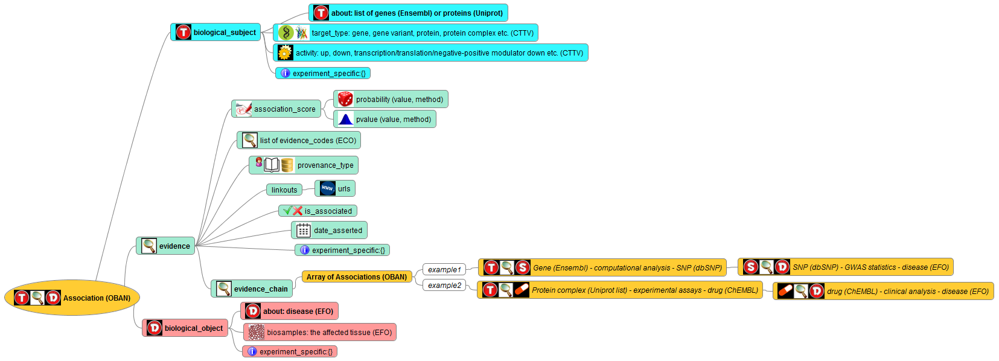

## Quick document links

####  [**Changes in JSON schema from 1.0 to 1.1**](changes/version_changes.md)

####  [**CTTV pipeline projects and target-disease associations (TD-associations)**](json_schema/project_tracker.md)

####  [**CTTV TD-associations FAQs**](help/README.md)

####  [**CTTV URIs and namespaces**](json_schema/cttv_uris_namespaces.md)

## Schema 1.1 overview

## Folder content

1. [**help**](./help/)	- Frequently asked questions.

1. [**examples**](./examples/)	- Example instances of json strings produced by different CTTV pipeline projects.

1. [**json_schema**](./json_schema/) - The primary json schema against which json instances will be validated.

1. [**ontology**](./ontology/) - The CTTV core association ontology.

1. [**scripts**](./scripts/) - JSON-preparation scripts written by CTTV project members.

1. [**packages**](./packages/) - Software packages written for generating CTTV "evidence string" objects

## What is the CTTV TD-association format?

#### Aim

The CTTV “TD-association format” defines a graph-based model for capturing target (i.e. a gene or a protein) to disease evidence from a number of disparate data sources. It is effectively the “currency” for the CTTV database project (CTTV001) to receive and process disease evidence from different CTTV workstreams.

#### Description of the format

The platform is currently accepting data in JSON (javascript object notation) format. Please use the provided JSON schema to prepare/fit your data to this model.

#### Current status

We are preparing a [JSON schema](./json_schema) to ensure validity of the data provided. We may develop formats in addition to JSON in the future for pulling data into the system.