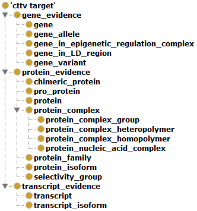
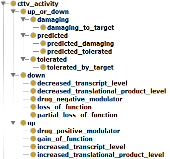

# Namespace prefixes and resources in CTTV ontology

<!-- START doctoc generated TOC please keep comment here to allow auto update -->
<!-- DON'T EDIT THIS SECTION, INSTEAD RE-RUN doctoc TO UPDATE -->
**Table of Contents**  

  - [CTTV target ontology](#cttv-target-ontology)
  - [CTTV biological activity (in disease) ontology](#cttv-biological-activity-in-disease-ontology)

<!-- END doctoc generated TOC please keep comment here to allow auto update -->

## CTTV target ontology
The figure below shows the various definitions of 'target' as used in the CTTV core ontology. One of these terms needs to be used in the **{biological_subject}{target_type}** field of the JSON file to specify what kind of target you are describing:



#### URIs corresponding to the above target ontology:

```javascript
http://identifiers.org/cttv.target/gene_evidence
    http://identifiers.org/cttv.target/gene
    http://identifiers.org/cttv.target/gene_allele
    http://identifiers.org/cttv.target/gene_in_epigenetic_regulation_complex
    http://identifiers.org/cttv.target/gene_in_LD_region
    http://identifiers.org/cttv.target/gene_variant
http://identifiers.org/cttv.target/protein_evidence
    http://identifiers.org/cttv.target/chimeric_protein
    http://identifiers.org/cttv.target/pro_protein
    http://identifiers.org/cttv.target/protein
    http://identifiers.org/cttv.target/protein_complex
        http://identifiers.org/cttv.target/protein_complex_group
        http://identifiers.org/cttv.target/protein_complex_heteropolymer
        http://identifiers.org/cttv.target/protein_complex_homopolymer
        http://identifiers.org/cttv.target/protein_nucleic_acid_complex
    http://identifiers.org/cttv.target/protein_family
    http://identifiers.org/cttv.target/protein_isoform
    http://identifiers.org/cttv.target/selectivity_group
http://identifiers.org/cttv.target/transcript_evidence
    http://identifiers.org/cttv.target/transcript
    http://identifiers.org/cttv.target/transcript_isoform
```

## CTTV biological activity [in disease] ontology
The figure below shows the various definitions of 'biological activity' as used in the CTTV core ontology. One of these terms needs to be used in the **{biological_subject}{activity}** field of the JSON file to specify what kind of biological activity was observed in the target-disease association:



#### URNs corresponding to the above biological activity ontology:

```javascript
http://identifiers.org/cttv.activity/down
    http://identifiers.org/cttv.activity/decreased_transcript_level
    http://identifiers.org/cttv.activity/decreased_translational_product_level
    http://identifiers.org/cttv.activity/drug_negative_modulator
    http://identifiers.org/cttv.activity/loss_of_function
    http://identifiers.org/cttv.activity/partial_loss_of_function
http://identifiers.org/cttv.activity/unknown
    http://identifiers.org/cttv.activity/damaging
    	http://identifiers.org/cttv.activity/damaging_to_target
    http://identifiers.org/cttv.activity/predicted
    	http://identifiers.org/cttv.activity/predicted_damaging
        http://identifiers.org/cttv.activity/predicted_tolerated
http://identifiers.org/cttv.activity/up
    http://identifiers.org/cttv.activity/drug_positive_modulator
    http://identifiers.org/cttv.activity/gain_of_function
    http://identifiers.org/cttv.activity/increased_transcript_level
    http://identifiers.org/cttv.activity/increased_translational_product_level
```
